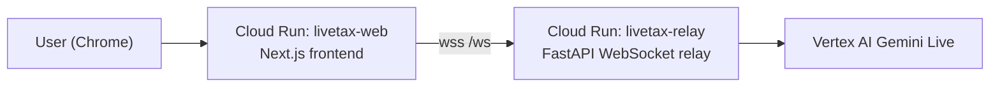

# LiveTax Agent

Voice-first Gemini Live tax assistant with a Next.js frontend and a FastAPI websocket relay backend.

## Architecture



## Local setup

Frontend:

```bash
npm install
cp .env.example .env.local
npm run dev
```

Backend:

```bash
cd backend
python3 -m venv venv
source venv/bin/activate
pip install -r requirements.txt
cp .env.example .env
gcloud config set project YOUR_PROJECT_ID
gcloud services enable aiplatform.googleapis.com
gcloud auth application-default login
uvicorn main:app --host 127.0.0.1 --port 8000
```

The frontend expects the backend websocket at `ws://127.0.0.1:8000/ws` by default.

## Cloud Run deployment

Current Google docs used:

- [Cloud Run deployment overview](https://cloud.google.com/run/docs/deploying)
- [Cloud Run WebSockets](https://docs.cloud.google.com/run/docs/triggering/websockets)
- [Vertex AI Gemini Live SDK guide](https://docs.cloud.google.com/vertex-ai/generative-ai/docs/live-api/get-started-sdk)

Recommended production shape:

- `livetax-relay`: backend websocket relay on Cloud Run
- `livetax-web`: frontend on Cloud Run

### 1. One-time Google Cloud setup

```bash
gcloud config set project YOUR_PROJECT_ID
gcloud services enable run.googleapis.com aiplatform.googleapis.com cloudbuild.googleapis.com artifactregistry.googleapis.com
gcloud auth application-default login
```

Create a backend service account and grant Vertex access:

```bash
gcloud iam service-accounts create livetax-relay --display-name="LiveTax Relay"
gcloud projects add-iam-policy-binding YOUR_PROJECT_ID \
  --member="serviceAccount:livetax-relay@YOUR_PROJECT_ID.iam.gserviceaccount.com" \
  --role="roles/aiplatform.user"
```

### 2. Deploy backend first

```bash
PROJECT_ID=YOUR_PROJECT_ID \
REGION=us-central1 \
SERVICE_ACCOUNT=livetax-relay@YOUR_PROJECT_ID.iam.gserviceaccount.com \
ALLOWED_ORIGINS=https://YOUR_WEB_URL \
bash deployment/deploy-backend.sh
```

After deploy, note the backend HTTPS URL and convert it to websocket form:

`https://livetax-relay-xxxxx.run.app` -> `wss://livetax-relay-xxxxx.run.app/ws`

### 3. Deploy frontend second

```bash
PROJECT_ID=YOUR_PROJECT_ID \
REGION=us-central1 \
BACKEND_URL=wss://YOUR_BACKEND_RUN_URL/ws \
bash deployment/deploy-web.sh
```

### 4. Update backend allowed origins

After the frontend URL exists, redeploy the backend with:

```bash
PROJECT_ID=YOUR_PROJECT_ID \
REGION=us-central1 \
SERVICE_ACCOUNT=livetax-relay@YOUR_PROJECT_ID.iam.gserviceaccount.com \
ALLOWED_ORIGINS=https://YOUR_WEB_RUN_URL \
bash deployment/deploy-backend.sh
```

## Required environment

Backend:

- `GOOGLE_CLOUD_PROJECT`
- `GOOGLE_CLOUD_LOCATION` optional, defaults to `us-central1`
- `GEMINI_LIVE_MODEL` optional, defaults to `gemini-live-2.5-flash-native-audio`
- `ALLOWED_ORIGINS` optional

Frontend:

- `BACKEND_WS_URL` optional, defaults to `ws://127.0.0.1:8000/ws`

## Current architecture

- Next.js frontend renders the voice workspace and the IRS Form 1040 PDF.
- Browser microphone audio is captured with an `AudioWorklet`.
- Audio, text, and dropped files stream to a FastAPI websocket backend.
- Backend owns the Gemini Live session and relays:
  - input transcription
  - output transcription
  - streamed audio
  - session status

## Notes

- The backend authenticates with Vertex AI through Application Default Credentials.
- The right pane currently shows the source PDF; live PDF field-filling is the next layer to wire.
