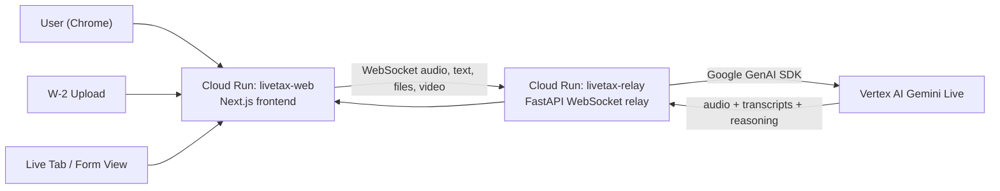

# LiveTax Agent

LiveTax Agent is a voice-first multimodal tax copilot built for the Google Live Agent Challenge.

The demo shows a user speaking naturally with a Gemini-powered agent while working through a U.S. tax form. The agent can listen to the user, inspect an uploaded W-2, watch the live tax-form workspace, and respond with spoken guidance in real time. Instead of acting like a text chatbot, it behaves like a live assistant that understands documents, screen context, and interruptions.

## What the project does

LiveTax Agent helps a user work through Form 1040 with a realtime Gemini Live session.

Core demo flow:

- The user opens the app and starts speaking immediately.
- The agent greets the user and asks what tax document they need help with.
- The user uploads a W-2 image or PDF.
- Gemini inspects the document and extracts important visible tax values.
- The user can share the live app tab so Gemini can see the tax form workspace on the right.
- The user can ask questions like “does this field look right?” or point to a visible area on the form.
- The agent responds with spoken guidance and supports interruption/barge-in.

## Why this is more than a chatbot

This project is explicitly multimodal and agentic.

Inputs:

- Voice input from the microphone
- Uploaded W-2 images or PDFs
- Live visual context from the shared app tab and visible Form 1040 workspace
- Optional typed chat input

Outputs:

- Native audio responses from Gemini Live
- Typed replies in the chat thread when the user explicitly uses chat
- Live contextual guidance based on what is visible in the form workspace

Agent behavior:

- Understands speech in real time
- Reads documents
- Uses live on-screen visual context
- Handles interruption during spoken responses
- Continues the same task instead of restarting on every new document

## Google technologies used

This project satisfies the challenge requirements with the following stack:

- Gemini model: `gemini-live-2.5-flash-native-audio`
- Google GenAI SDK: used in the backend relay to connect to Gemini Live
- Vertex AI: used for Gemini Live sessions on Google Cloud
- Cloud Run: used to deploy both the frontend and the backend relay

Relevant implementation files:

- [`backend/gemini_client.py`](/Users/jaykilaparthi/Desktop/livetax-agent/backend/gemini_client.py)
- [`components/live-tax/use-gemini-live.ts`](/Users/jaykilaparthi/Desktop/livetax-agent/components/live-tax/use-gemini-live.ts)
- [`components/live-tax/workspace.tsx`](/Users/jaykilaparthi/Desktop/livetax-agent/components/live-tax/workspace.tsx)

## Architecture



### Architecture notes

- The frontend is a Next.js app hosted on Cloud Run.
- The backend is a FastAPI WebSocket relay hosted separately on Cloud Run.
- The backend owns the Gemini Live session for stability and Google Cloud deployment alignment.
- Browser microphone audio is captured with an `AudioWorklet`.
- The frontend can share the current browser tab, crop the right-side workspace, and stream it into Gemini Live as video input.
- The backend relays text, audio, image, and video inputs to Gemini Live and returns audio responses to the browser.

## Key implementation choices

### 1. Backend-owned Live session

We initially explored a browser-direct Live API approach, but moved to a backend relay architecture for more reliable voice behavior, easier debugging, cleaner Cloud Run deployment, and tighter control over multimodal streaming.

### 2. Voice-first UX with typed fallback

The interface is designed to feel like a live assistant first. Microphone capture starts automatically after connection, while typed chat remains available for fallback and explicit text interactions.

### 3. Live visual context instead of static form context only

Sending the PDF once was not enough for real guidance. The app now supports live tab sharing so Gemini can inspect visible edits and on-screen context, not just the original uploaded document.

### 4. Minimal but intentional UI

The UI is intentionally quiet: small typography, subtle controls, a voice-first visualizer, and a restrained chat thread that only shows explicit typed/file interactions instead of verbose live transcripts.

## Features

- Voice-first Gemini Live session
- Native audio output
- W-2 upload support for image and PDF documents
- Live tab sharing for visual reasoning over the form workspace
- Real-time interruption / barge-in
- Minimal split-screen interface
- Real IRS Form 1040 shown on the right side
- Cloud Run deployment

## Findings and learnings

Key lessons from building the project:

- Multimodal context matters more than a larger static prompt. The agent became meaningfully better once it could see the live workspace instead of only the initial PDF.
- Browser-direct realtime media is possible, but a backend relay was much more stable for a hackathon-quality demo.
- Prompting strongly affects perceived quality. Slower speaking behavior, better W-2 extraction instructions, and explicit “continue the conversation” rules noticeably improved the experience.
- Barge-in needs transport-level handling, not just prompting. We had to explicitly interrupt playback and notify the session when the user started speaking over the model.
- Judges respond better to a tight, believable workflow than to broad scope. Focusing on one paperwork flow produced a stronger demo.

## Repository structure

```text
livetax-agent/
├── app/                     # Next.js app shell
├── components/              # UI and live session client code
├── backend/                 # FastAPI relay and Vertex AI Gemini Live integration
├── deployment/              # Cloud Run deploy scripts
├── public/                  # Static assets including Form 1040 and audio worklet
└── README.md
```

## Local setup

Frontend:

```bash
npm install
cp .env.example .env.local
npm run dev
```

Backend:

```bash
cd backend
python3 -m venv venv
source venv/bin/activate
pip install -r requirements.txt
cp .env.example .env
gcloud config set project YOUR_PROJECT_ID
gcloud services enable aiplatform.googleapis.com
gcloud auth application-default login
python -m uvicorn main:app --host 127.0.0.1 --port 8000
```

The frontend expects the backend websocket at `ws://127.0.0.1:8000/ws` by default.

## Cloud deployment

The production deployment uses:

- `livetax-web` on Cloud Run
- `livetax-relay` on Cloud Run
- Vertex AI for Gemini Live

Deployment helpers are included here:

- [`deployment/deploy-web.sh`](/Users/jaykilaparthi/Desktop/livetax-agent/deployment/deploy-web.sh)
- [`deployment/deploy-backend.sh`](/Users/jaykilaparthi/Desktop/livetax-agent/deployment/deploy-backend.sh)

## Demo notes

For the cleanest demo:

- Start with the agent already connected
- Use a clear sample W-2
- Share the app tab when you want the agent to inspect the visible form
- Ask one or two concrete questions about visible edits
- Keep the flow tight and under two minutes
